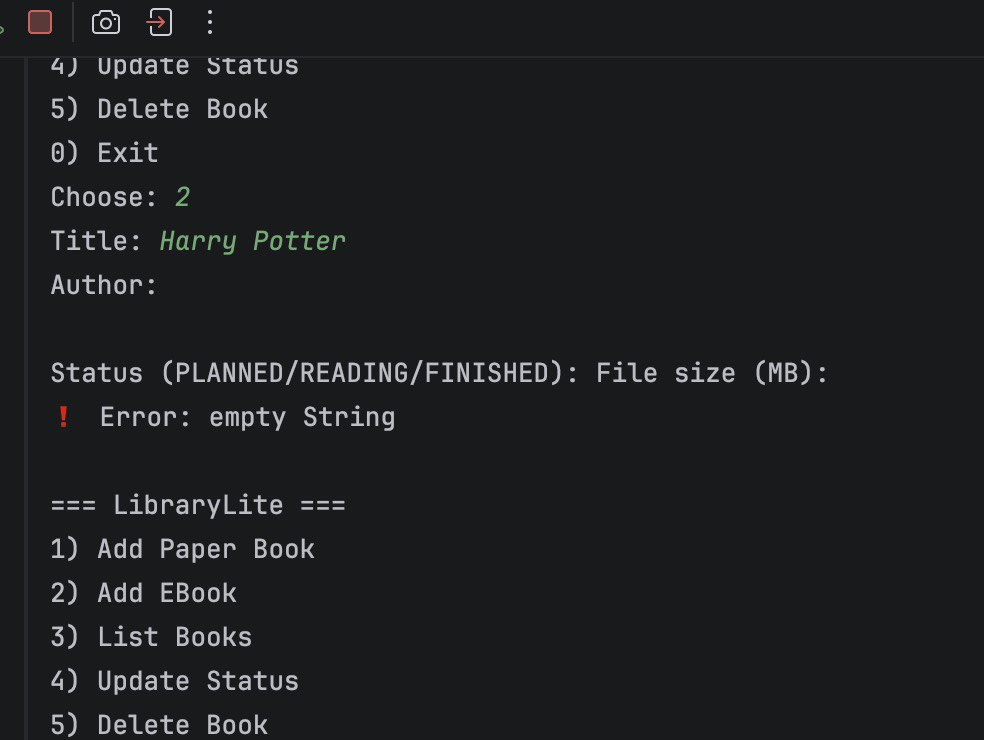
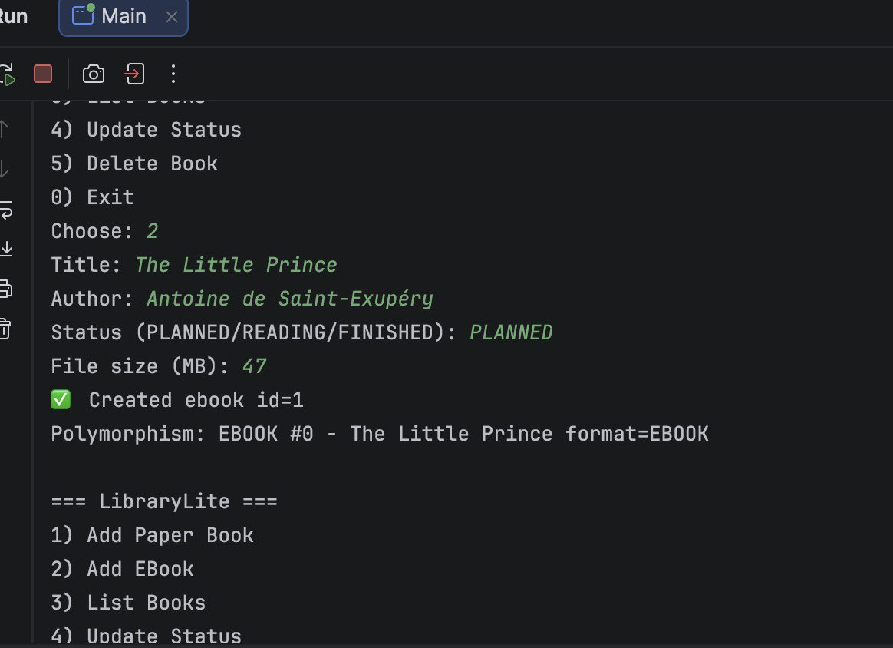
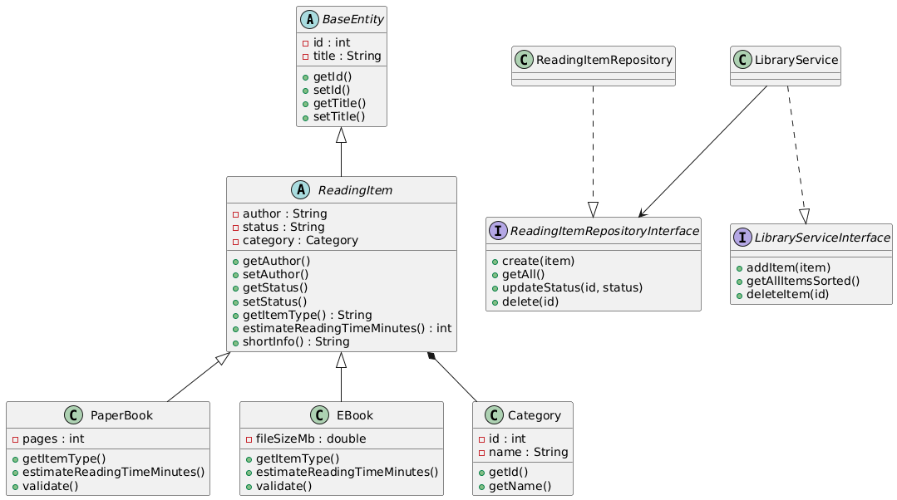

# LibraryLite API — Assignment 4 (SOLID + Advanced OOP)

A console-based Java Library Management API demonstrating **SOLID principles**, **layered architecture**, and **advanced Java features**.

---

## Project Architecture

The application follows a clean layered structure:
controller → service → repository → database

| Layer | Responsibility |
|------|----------------|
| Controller | User interaction (Main class) |
| Service | Business logic, validation, exceptions |
| Repository | JDBC/database operations |
| Model | Entities (ReadingItem, PaperBook, Category, etc.) |
| Utils | Reflection utilities |

---

## OOP Design

### Abstract Base Class
`ReadingItem` is an abstract class that defines shared behavior.

- Contains common fields (author, status)
- Has **abstract methods**:
    - `getItemType()`
    - `estimateReadingTimeMinutes()`
- Has **concrete method**:
    - `shortInfo()`

###  Subclasses (LSP)
- `PaperBook`
- `EBook`

They extend `ReadingItem` and override abstract methods, demonstrating **polymorphism**.

---

##  Composition

`ReadingItem → Category`

Each reading item belongs to a category.

In OOP:
java
protected Category category;

In Database:
category_id INT REFERENCES categories(id)


## Interfaces (ISP + Default Methods)

Interface `Readable` contains a default method:

```java
public interface Readable {

    String getFormat();

    default void printBasicInfo() {
        System.out.println("Format: " + getFormat());
    }
}
```
##  SOLID Principles

| Principle | How Applied |
|----------|-------------|
| **SRP** (Single Responsibility) | Service layer handles business logic, repository layer handles database operations. |
| **OCP** (Open/Closed) | New book types (e.g., AudioBook) can be added without modifying existing logic. |
| **LSP** (Liskov Substitution) | PaperBook and EBook work through the ReadingItem base class. |
| **ISP** (Interface Segregation) | Small focused interfaces such as Readable and Repository interfaces are used. |
| **DIP** (Dependency Inversion) | Service depends on repository interfaces, not concrete classes. |

---

##  Advanced Java Features

| Feature | Usage in Project |
|---------|------------------|
| **Generics** | Generic repository interface design |
| **Lambdas** | Sorting reading items by title |
| **Reflection** | `ReflectionUtils` dynamically prints object fields |
| **Default methods** | Interface `Readable` provides shared behavior |

---

##  Reflection Utility

`ReflectionUtils` inspects object fields at runtime:

```java
ReflectionUtils.printFields(book);
```
## Screenshots

### Add Book


### List Books


### Validation Error
![Validation]

### Reflection Output
![Reflection]

### UML Diagram
![UML]
